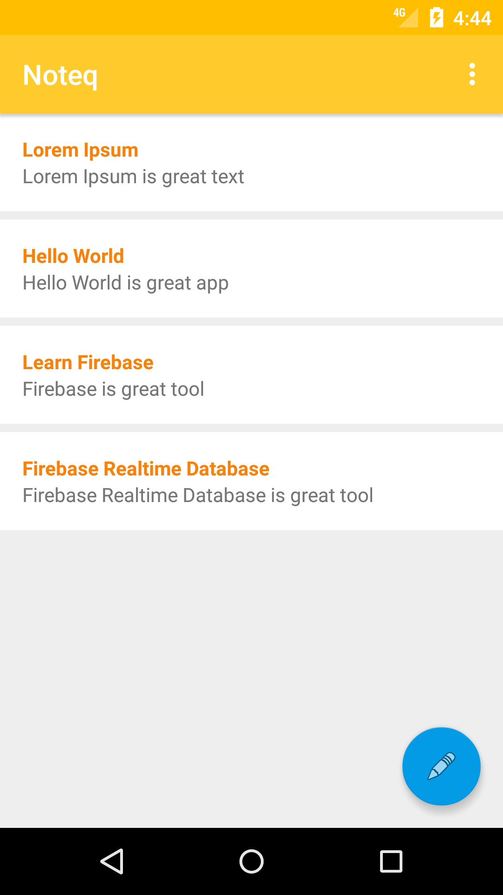

# Noteq

Example Notes Android App using Firebase

### ToDo
* [x] List of Note
* [x] Add Note
* [ ] Update Note
* [ ] Remove Note

### References
* [Firebase Realtime Database][rd_link]
* [Android Guidelines][adgl_url]
* [Architecture of Android Apps][archi_ar_url]
* [Using the RecyclerView][rv_link]
* [A View Divided][view_divided_link]

[rd_link]: https://firebase.google.com/docs/database/
[adgl_url]: https://github.com/ribot/android-guidelines
[archi_ar_url]: https://guides.codepath.com/android/Architecture-of-Android-Apps
[rv_link]: https://guides.codepath.com/android/Using-the-RecyclerView
[view_divided_link]: https://www.bignerdranch.com/blog/a-view-divided-adding-dividers-to-your-recyclerview-with-itemdecoration/
